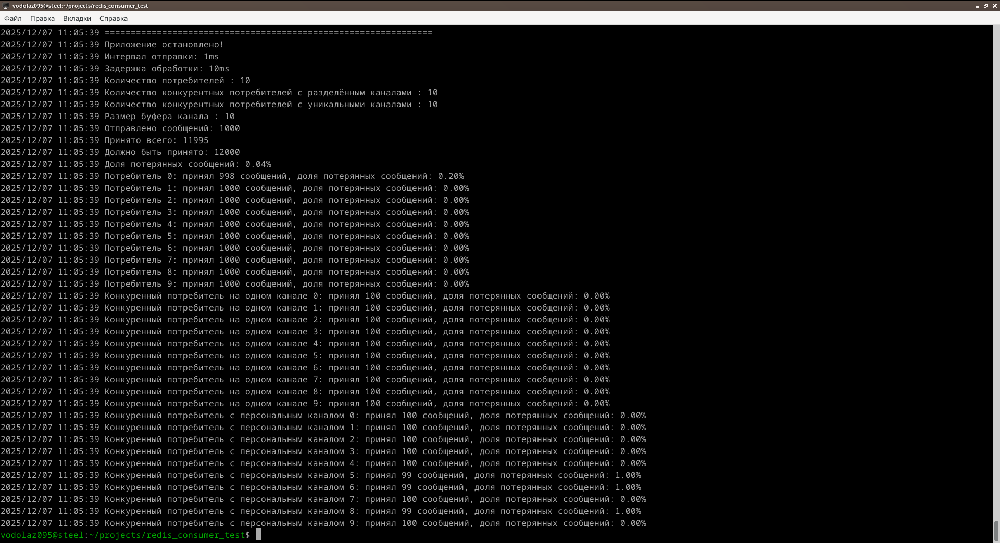

Redis Consumer Test
===============================
Попытка разобраться, можно ли использовать PubSub очереди в редис как надёжный механизм доставки.

Как проверить самому
================================

1. Запустить redis - можно через docker/podman compose
    ```shell
    $ make podman/up
    $ make docker/up
    ```

2. Изменить константы в `main.go`
3. Запустить по `make start`
4. CTRL+C - останавливает приложение и выводит статистику

Замечено
===============================
1. При потреблении сообщения попадают в буферизированный канал внутри драйвера редиса
2. При перезапуске приложения сообщения теряются
3. Если мы хотим запустить более одного потребителя, то все потребители получают один и тот же набор 
   сообщений - механизм распределения задач надо делать самому.
4. При тестах теряется порядка 0.1% сообщений.

```

2025/12/07 11:05:39 ===============================================================
2025/12/07 11:05:39 Приложение остановлено!
2025/12/07 11:05:39 Интервал отправки: 1ms
2025/12/07 11:05:39 Задержка обработки: 10ms
2025/12/07 11:05:39 Количество потребителей : 10
2025/12/07 11:05:39 Количество конкурентных потребителей с разделённым каналами : 10
2025/12/07 11:05:39 Количество конкурентных потребителей с уникальными каналами : 10
2025/12/07 11:05:39 Размер буфера канала : 10
2025/12/07 11:05:39 Отправлено сообщений: 1000
2025/12/07 11:05:39 Принято всего: 11995
2025/12/07 11:05:39 Должно быть принято: 12000
2025/12/07 11:05:39 Доля потерянных сообщений: 0.04%
2025/12/07 11:05:39 Потребитель 0: принял 998 сообщений, доля потерянных сообщений: 0.20%
2025/12/07 11:05:39 Потребитель 1: принял 1000 сообщений, доля потерянных сообщений: 0.00%
2025/12/07 11:05:39 Потребитель 2: принял 1000 сообщений, доля потерянных сообщений: 0.00%
2025/12/07 11:05:39 Потребитель 3: принял 1000 сообщений, доля потерянных сообщений: 0.00%
2025/12/07 11:05:39 Потребитель 4: принял 1000 сообщений, доля потерянных сообщений: 0.00%
2025/12/07 11:05:39 Потребитель 5: принял 1000 сообщений, доля потерянных сообщений: 0.00%
2025/12/07 11:05:39 Потребитель 6: принял 1000 сообщений, доля потерянных сообщений: 0.00%
2025/12/07 11:05:39 Потребитель 7: принял 1000 сообщений, доля потерянных сообщений: 0.00%
2025/12/07 11:05:39 Потребитель 8: принял 1000 сообщений, доля потерянных сообщений: 0.00%
2025/12/07 11:05:39 Потребитель 9: принял 1000 сообщений, доля потерянных сообщений: 0.00%
2025/12/07 11:05:39 Конкуренный потребитель на одном канале 0: принял 100 сообщений, доля потерянных сообщений: 0.00%
2025/12/07 11:05:39 Конкуренный потребитель на одном канале 1: принял 100 сообщений, доля потерянных сообщений: 0.00%
2025/12/07 11:05:39 Конкуренный потребитель на одном канале 2: принял 100 сообщений, доля потерянных сообщений: 0.00%
2025/12/07 11:05:39 Конкуренный потребитель на одном канале 3: принял 100 сообщений, доля потерянных сообщений: 0.00%
2025/12/07 11:05:39 Конкуренный потребитель на одном канале 4: принял 100 сообщений, доля потерянных сообщений: 0.00%
2025/12/07 11:05:39 Конкуренный потребитель на одном канале 5: принял 100 сообщений, доля потерянных сообщений: 0.00%
2025/12/07 11:05:39 Конкуренный потребитель на одном канале 6: принял 100 сообщений, доля потерянных сообщений: 0.00%
2025/12/07 11:05:39 Конкуренный потребитель на одном канале 7: принял 100 сообщений, доля потерянных сообщений: 0.00%
2025/12/07 11:05:39 Конкуренный потребитель на одном канале 8: принял 100 сообщений, доля потерянных сообщений: 0.00%
2025/12/07 11:05:39 Конкуренный потребитель на одном канале 9: принял 100 сообщений, доля потерянных сообщений: 0.00%
2025/12/07 11:05:39 Конкуренный потребитель с персональным каналом 0: принял 100 сообщений, доля потерянных сообщений: 0.00%
2025/12/07 11:05:39 Конкуренный потребитель с персональным каналом 1: принял 100 сообщений, доля потерянных сообщений: 0.00%
2025/12/07 11:05:39 Конкуренный потребитель с персональным каналом 2: принял 100 сообщений, доля потерянных сообщений: 0.00%
2025/12/07 11:05:39 Конкуренный потребитель с персональным каналом 3: принял 100 сообщений, доля потерянных сообщений: 0.00%
2025/12/07 11:05:39 Конкуренный потребитель с персональным каналом 4: принял 100 сообщений, доля потерянных сообщений: 0.00%
2025/12/07 11:05:39 Конкуренный потребитель с персональным каналом 5: принял 99 сообщений, доля потерянных сообщений: 1.00%
2025/12/07 11:05:39 Конкуренный потребитель с персональным каналом 6: принял 99 сообщений, доля потерянных сообщений: 1.00%
2025/12/07 11:05:39 Конкуренный потребитель с персональным каналом 7: принял 100 сообщений, доля потерянных сообщений: 0.00%
2025/12/07 11:05:39 Конкуренный потребитель с персональным каналом 8: принял 99 сообщений, доля потерянных сообщений: 1.00%
2025/12/07 11:05:39 Конкуренный потребитель с персональным каналом 9: принял 100 сообщений, доля потерянных сообщений: 0.00%


```

